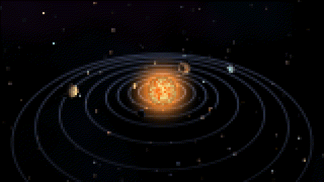
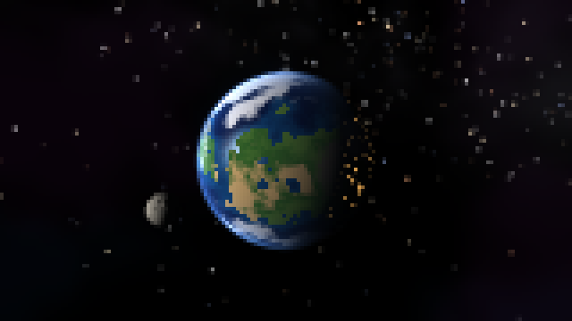
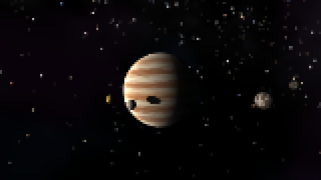
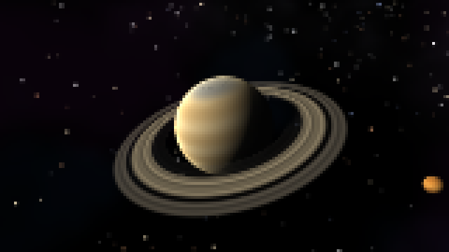
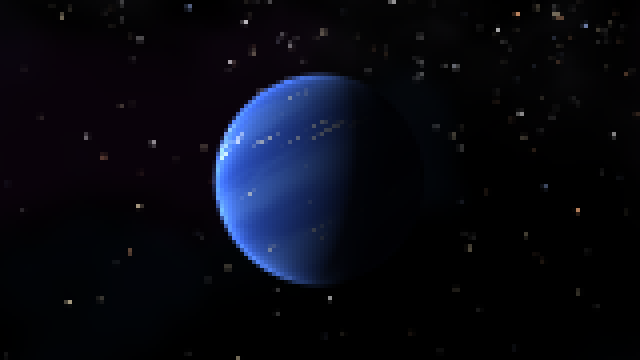

# Planets

The solar system, ray traced in real time, right inside your terminal.

Planets is a screensaver written in pure C. It renders every frame with its own little ray tracer and draws it using nothing but colored text characters. No graphics library, no GPU, no image files. Start it, lean back, and watch it glide past every planet from Mercury to Neptune, over and over, until you close the window.

<p align="center">
  
</p>

<p align="center">
  
  
</p>
<p align="center">
  
  
</p>
<p align="center"><sub>Real terminal output: every square is half of one character.</sub></p>

## The tour

Mercury → Venus → Earth → Mars → Jupiter → Saturn → Uranus → Neptune → Solar system

## How it works

Every frame is ray traced on the CPU. For each pixel, Planets shoots a ray into the scene and tests it against spheres for the planets and moons, and against flat rings for Saturn and Uranus. Whatever it hits gets lit by the Sun, and shadow rays decide what lies in shade. That is how the moons cast little black dots onto Jupiter, and how Saturn throws its shadow across its own rings. Where two objects meet, the edge pixels get four extra rays, so the outlines stay smooth.

None of the planets use image textures. Their surfaces are computed pixel by pixel from 3D noise: continents, clouds and ice caps on Earth, flowing bands and storms on the gas giants, and bump-mapped craters on Mercury and the Moon.

A terminal has no pixels, so each character cell shows two: the upper half block `▀` with a 24-bit text color for the top pixel and a background color for the bottom one. Only cells that changed since the last frame are sent, and the rendering is split across up to 8 threads, so it holds 60 fps even in a fullscreen terminal.

All of this is one C11 file of about 1,500 lines that needs only libc, libm and pthreads. `make test` checks it with AddressSanitizer, UndefinedBehaviorSanitizer and ThreadSanitizer, and GitHub Actions runs those tests with gcc and clang on every push.

## Install

You need Linux (tested on Debian Trixie in WSL), gcc and make, and a terminal with 24-bit color. Windows Terminal, GNOME Terminal, Konsole, kitty and Alacritty all work.

```bash
sudo apt install build-essential git
git clone https://github.com/fusionfall33exe-cell/planets-screensaver.git
cd planets-screensaver
make && make install
```

That installs the command `Planets` to `~/.local/bin`. If your shell can't find it yet, log out and back in.

On Windows, clone it to the Windows side, run `make && make install` there from WSL, and add the folder to your `PATH`. `Planets.cmd` then starts it from cmd and PowerShell as well.

## Usage

Just run `Planets`. The arrow keys (or `n` and `b`) switch planets, `Space` pauses, `+` and `-` change the speed, and `q` or `Esc` quits. Press `m` for ASCII art and `c` for 256 colors.

```
Planets [-t SEC] [-s N] [-r] [-f FPS] [-a] [-2] [-x]
  -t SEC   seconds per planet (default 25, 0 = stay on one)
  -s N     start with scene N (1-9)
  -r       random order instead of the tour from the Sun outwards
  -f FPS   frames per second (default 60; try 30 if it stutters)
  -a       ASCII shading instead of half-block pixels
  -2       256 colors, for terminals without 24-bit color
  -x       screensaver mode: any key quits
```

It also works as a real screensaver in tmux. With these two lines in `~/.tmux.conf`, the planets come out after five idle minutes and any key brings your session back:

```
set -g lock-after-time 300
set -g lock-command "Planets -x"
```

## License

MIT — see [LICENSE](LICENSE).
